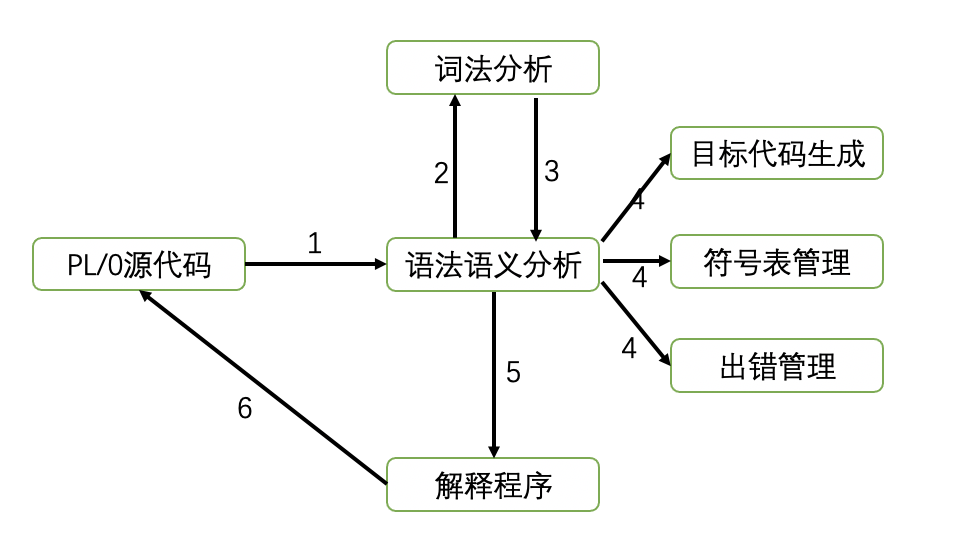
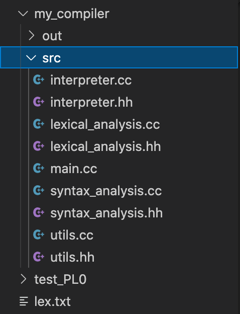

# 一 PL/0

## 1.1 简介

​	PL/0语言可以看成PASCAL语言的子集，它的编译程序是一个编译解释执行系统。PL/0的目标程序为假想栈式计算机的汇编语言，与具体计算机无关。其编译过程采用一趟扫描方式，以语法分析程序为核心，词法分析和代码生成程序都作为一个独立的过程，当语法分析需要读单词时就调用词法分析程序，而当语法分析正确需要生成相应的目标代码时，则调用代码生成程序。

​	PL/0用表格管理程序建立变量、常量和过程标示符的说明与引用之间的信息联系。用出错处理程序对词法和语法分析遇到的错误给出在源程序中出错的位置和错误性质。当源程序编译正确时，PL/0编译程序自动调用解释执行程序，对目标代码进行解释执行，并按用户程序的要求输入数据和输出运行结果。

## 1.2 PL/0 语言的 BNF 描述(扩充的巴克斯范式表示法)

```python
<prog> → program <id>；<block>
<block> → [<condecl>][<vardecl>][<proc>]<body>
<condecl> → const <const>{,<const>};
<const> → <id>:=<integer>
<vardecl> → var <id>{,<id>};
<proc> → procedure <id>（[<id>{,<id>}]）;<block>{;<proc>}
<body> → begin <statement>{;<statement>}end
<statement> → <id> := <exp>
               |if <lexp> then <statement>[else <statement>]
               |while <lexp> do <statement>
               |call <id>（[<exp>{,<exp>}]）
               |<body>
               |read (<id>{，<id>})
               |write (<exp>{,<exp>})
<lexp> → <exp> <lop> <exp>|odd <exp>
<exp> → [+|-]<term>{<aop><term>}
<term> → <factor>{<mop><factor>}
<factor>→<id>|<integer>|(<exp>)
<lop> → =|<>|<|<=|>|>=
<aop> → +|-
<mop> → *|/
<id> → l{l|d}   （注：l表示字母）
<integer> → d{d}

注释:
<prog>：程序;				<block>：块、程序体;				<condecl>：常量说明;
<const>：常量;				<vardecl>：变量说明;				 <proc>：分程序; 
<body>：复合语句;		 <statement>：语句;				 <exp>：表达式;
<lexp>：条件;  			<term>：项;								 <factor>：因子;
<aop>：加法运算符;		<mop>：乘法运算符; 					<lop>：关系运算符;
```

## 1.3 假想目标机的代码(可以看成是编译过程中对应的汇编代码)

```python
LIT 0 a : 取常量a放入数据栈栈顶
OPR 0 a : 执行运算，a表示执行某种运算，具体运算可以看代码
LOD L a : 取变量（相对地址为a，层差为L）放到数据栈的栈顶
STO L a : 将数据栈栈顶的内容存入变量（相对地址为a，层次差为L）
CAL L a : 调用过程（转子指令）（入口地址为a，层次差为L）
INT 0 a : 数据栈栈顶指针增加a
JMP 0 a : 无条件转移到地址为a的指令
JPC 0 a : 条件转移指令，转移到地址为a的指令
RED L a : 读数据并存入变量（相对地址为a，层次差为L）
WRT 0 0 : 将栈顶内容输出
  
代码的具体形式：F L A
其中：F段代表伪操作码
		 L段代表调用层与说明层的层差值
		 A段代表位移量（相对地址

进一步说明：
INT：为被调用的过程(包括主过程)在运行栈S中开辟数据区，这时A段为所需数据单元个数(包括三个连接数据),L段恒为0。
CAL：调用过程，这时A段为被调用过程的过程体(过程体之前一条指令)在目标程序区的入口地址。
LIT：将常量送到运行栈S的栈顶，这时A段为常量值。
LOD：将变量送到运行栈S的栈顶，这时A段为变量所在说明层中的相对位置。
STO：将运行栈S的栈顶内容送入某个变量单元中，A段为变量所在说明层中的相对位置。
JMP：无条件转移，这时A段为转向地址(目标程序)。
JPC：条件转移，当运行栈S的栈顶的布尔值为假(0)时，则转向A段所指目标程序地址；否则顺序执行。
OPR：关系或算术运算，A段指明具体运算，例如A=2代表算术运算“＋”,运算对象取自运行栈S的栈顶及次栈顶。
```

## 1.4 假想机的结构

两个存储器：

​		**PCode:** 用来存放上述目标代码；

​		**data_stack:** 开辟的栈区，用来存放动态分配的数据空间；

四个寄存器：

​	    **IP:** 指令寄存器I，存放当前要执行的代码；

  	  **T:**  栈顶指示器T，指向数据栈STACK的栈，栈顶不存放元素；
  	
  	  **B:**  基址寄存器B，存放当前运行过程的数据区在 data_stack 中的起始地址；每个过程调用，在栈顶都会分配			 三个联系单元，这三个单元分别为：

​			 **DL:** data_stack[T], 动态链，它是指向调用该过程前正在运行过程的数据段的基地址；

​			 **SL:** data_stack[T+1]，静态链，它是指向定义该过程的直接外过程运行时数据段的基地址。

​			 **RA:** data_stack[T+2]，返回地址，记录调用该过程时目标程序的断点，即当时的程序地址寄存器P的值。

 	   **P:**  程序地址寄存器，存放下一条要执行的指令的地址；

---

# 二 功能结构设计

## 2.1 综述

​	PL/0 总共分为词法分析、语法分析、语义分析(符号表管理和目标代码生成)、解释程序以及错误处理，PL/0以语法分析为核心，语义分析和错误处理集成在语法分析中，整体流程为：



代码整体架构如下所示：



​	其中，src为源代码中：main为主调用，syntax_analysis为语法分析部分，lexical_analysis为词法分析部分，interpreter 为解释程序部分，utils 为总体设置的数据结构，主要有目标代码和符号表的结构；out 为可执行文件的存在部分；test_PL0为PL/0源代码的部分；lex.txt为词法分析的结果。

## 2.2 词法分析

本程序将 PL/0 源代码的字符分为如下的部分：

```c++
int PROGRAM=1; // "program"
int BEGIN=2; // "begin"
int END=3; // "end"
int IF=4; // "if"
int THEN=5; // "then"
int ELSE=6; // "else"
int CON=7; // "const"
int PROCEDURE=8; // "procedure"
int VAR=9; // "var"
int DO=10; // "do"
int WHILE=11; // "while"
int CALL=12; // "call"
int READ=13; // "read"
int WRITE=14; // "write"
int REPEAT=15; // "repeat"
int ODD=16; // "odd"  // 和 key_words中相对应
int EQU=17; // "="
int LES=18; // "<"
int LESE=19; // "<="
int LARE=20; // ">="
int LAR=21; // ">"
int NEQU=22; // "<>"
int ADD=23; // "+"
int SUB=24; // "-"
int MUL=25; // "*"
int DIV=26; // "/"
int SYMBOL=27; // 标识符
int CONST=28; // 常量
int CEQU=29; // ":="
int COMMA=30; // ","
int SEMIC=31; // ";"
int POI=32; // "."
int LBR=33; // "("
int RBR=34; // ")"
```

依次读入 PL/0 源代码的买个单词，对应生成 lex.txt 词法分析结果，其中 lex.txt 中的每一行的数据结构为：

```c++
// 写入词法分析结果文件的每行的格式
struct RValue{
    int id; // 对应key_word
    std::string name; // 
    int line; // 在程序中的所在行
};
```

词法分析较为简单，代码中有详细的注释，相信你看代码可以看的懂。

## 2.3 语法分析

​	语法分析部分根据词法分析的结果 lex.txt 文件，根据 BNF 描述生成对应的符号表和目标代码，兼带着语义分析和错误处理。

生成符号表过程中需要注意的点如下：

(1) 符号表中每个过程的变量的地址是从3开始的，因为0、1、2被初始化的 DL, SL, RA 三个单元所占；

(2) 常量不占用地址空间，常量通过常量名即可得到，不需要通过变量地址；

(3) 过程的 size 为此过程的形参个数；

调用过程的步骤如下：

(1) 形参挨个入栈;

(2)call 过程名，T, T+1, T+2 分别为DL, SL, RA;

(3) 将栈中的形参值依次赋值给过程的形参变量，栈指针对应后退；

(4) 开辟占空间，T = T + (3+count(形参个数))；

下面以一例PL/0源程序加以分析：

```python
program p;
	var c;
	procedure p1(b1,b2,b3);
	begin
		c:=b1+b2+b3
	end	
begin 
	call p1(1,2,4);
	write(c)
		
end
```


语法分析后的符号表如下：

```python
type,name,level,address,value,size
2 c 0 3 0 0
3 p1 0 4 2 3
2 b1 1 3 0 0
2 b2 1 4 0 0
2 b3 1 5 0 0
```

目标代码如下：

```python
0: 	JMP  0  13
1: 	JMP  0  5
2: 	STO  0  5
3: 	STO  0  4
4: 	STO  0  3
5: 	INT  0  6
6: 	LOD  0  3
7: 	LOD  0  4
8: 	OPR  0  2
9: 	LOD  0  5
10:	OPR  0  2
11:	STO  1  3
12:	OPR  0  0
13: INT  0  4
14: LIT  0  1
15: LIT  0  2
16: LIT  0  4
17: CALL  0  2
18: LOD  0  3
19: OPR  0  14
20: OPR  0  15
21: OPR  0  0
```

可以看出，在符号表中：

(1) 变量c属于主过程p, 地址为3;

(2) 过程p1属于主过程p, 地址为4;

(3) 变量b1、b2、b3属于过程p1, level 相应+1，地址分别为3、4、5;

目标代码中，重点讨论下CALL 过程，步骤如下:

(1) 14、15、16 三行为 CALL 之前形参的入栈，T增加了3；

(2) 17行 CALL 之后，解释程序中会将 DL、SL、RA 分别赋值给 data_stack[T]、data_stack[T+1]、data_stack[T+2] ，注意此时 T 并没有增加；

(3) CALL 之后跳到行2，三个 STO 出栈赋值到变量 b3、b2、b1, T减少3；

(4) INT 0 6 : T = T + 6, 此时 T 指向 RA 之上的一个位置；

(5) 第 12 行退栈，OPR 0 0， 此时退到调用 p1 过程主过程 p 中；

## 2.4 解释部分

​	解释过程中，有个函数：

```c++
int Interpreter::get_base(int B, int L) {
    int old_B = B;
    while(L > 0) {
        old_B = data_stack[old_B+1];
        L--;
    }
    return old_B;
}
```

​	一个过程A调用另一个过程B和变量C，B一定在A所在层的同一层或者上几层，C也一定在A的同层或者上几层。

当在一个过程中用到某个变量 x, 需要知道此变量所在的位置，即所在的层和所在层的地址。get_base 函数通过找到定义此过程的外过程，依次找到对应的过程即可。

​	解释部分代码不难，具体看代码即可。

---

## 2.5 程序运行

(1) 编译程序：

​	进入 PL-0-C++ 目录

​	`g++ -std=c++11  -o my_compiler/out/main my_compiler/src/*.cc`

(2) 运行程序：

​	`my_compiler/out/main `

(3) 输入的PL/0源程序为绝对路径即可。